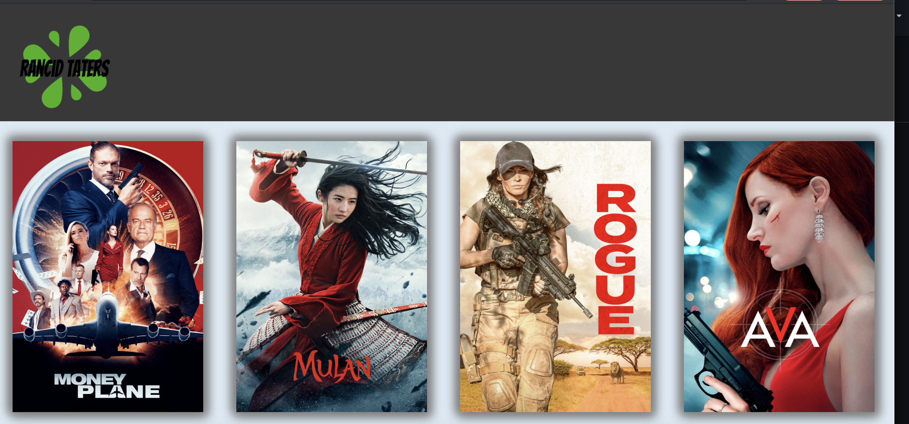

# Rancid Taters

#### This website is completely different from IMDB and Rotton Tomatoes

## Overview

* Rancid Taters is a movie data base application that allows the user to select a movie from the list
of movies, and see information relevant to the selected movie, including a link to a trailer. The application
uses router to allow for a simulated multi-page user experience with fully functional navigation arrows.

## Learning goals

# Joint

* Using router to simulate a multi-page application.
* Using Cypress to test for multiple user flows.
* Using react to create a dynamically updating UI

# Individual

* Matt - Additionally I wanted to get more practice with responsive/mobile design.
* Andrew - Additionally I wanted to improve on conditional rendering and responsive design.

## Project Links

* [Repo](https://github.com/mcraig2342/rancid-tomatillos)
* [Deploy Link](http://rancid-taters.surge.sh)

## Contributors

* [Matt Craig](https://github.com/mcraig2342)
* [Andrew Carlin](https://github.com/AndieDrew)

## Road Map

* Dashboard shows list of all movies using mock data
* A user can view a movies details
* Data is fetched from an API and mock data is no longer used
* Added router to simulate multiple pages
* Added cypress testing
* Added videos to details page and responsive design

##### Future Iterations Should Include:

* The ability to cycle through relevant movies
* Fully responsive design across multiple browsers.
* A search bar to search for movies.

## Screenshots

Dashboard 
 

Details 
 

